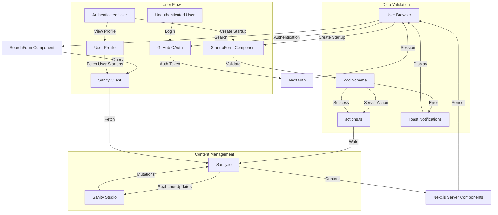

# YC Directory Data Flow

## Flow Description

1. **Authentication Flow**
   - User initiates login through GitHub
   - NextAuth handles OAuth flow and session management
   - Session information is available throughout the app

2. **Startup Creation Flow**
   - Authenticated user fills StartupForm
   - Client-side validation through Zod
   - Server action processes validated data
   - Data is stored in Sanity.io
   - User receives success/error notification

3. **Search Flow**
   - User enters search query
   - Query processed by Sanity client
   - Results fetched and rendered through Server Components
   - Real-time updates if content changes

4. **Content Management Flow**
   - Sanity Studio provides admin interface
   - Content changes trigger real-time updates
   - CDN caches content for performance
   - Server Components re-render with new data
